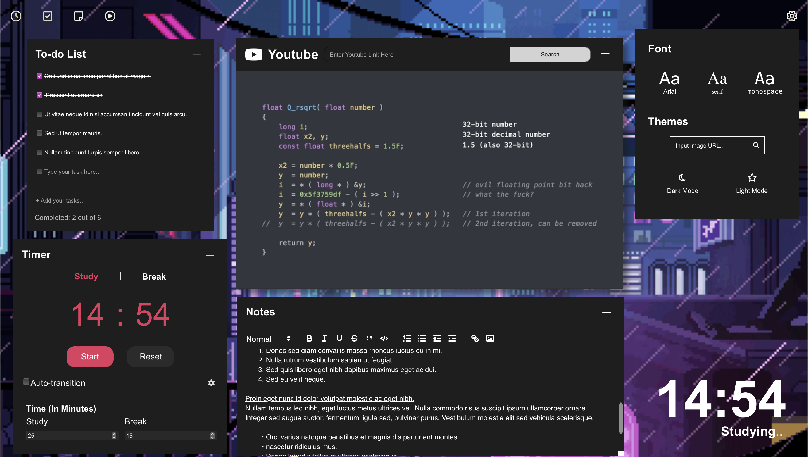
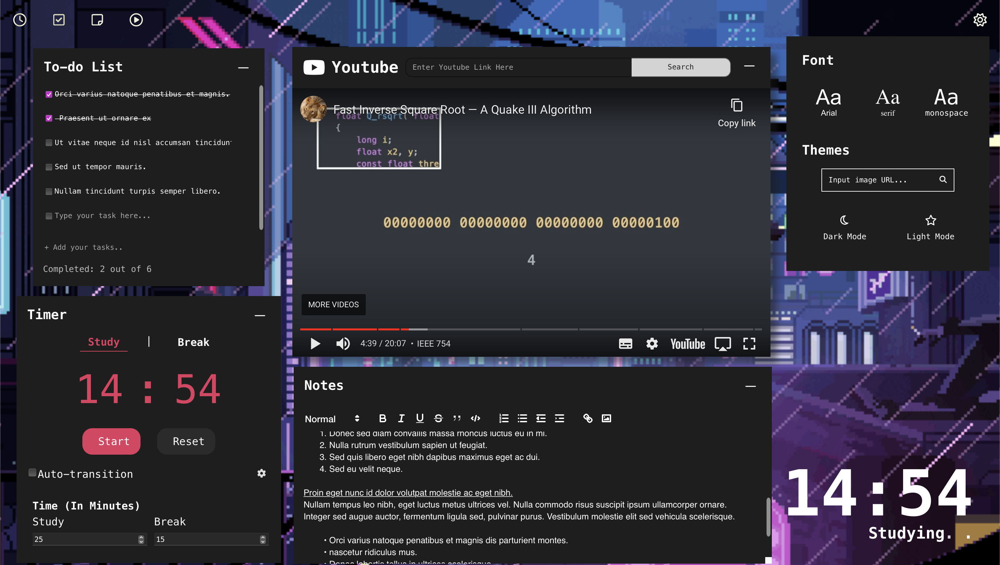

# Loft

## Summary

Loft is a productivity web app with the following widgets,

- Customizable Pomodoro Timer
- Youtube Video Player
- Notepad with Text Formatting
- To Do List

as well as customization settings supporting,

- Themes
  - light mode
  - dark mode
- Fonts
  - Arial
  - Serif
  - Monospace

# Gallery

## Widgets

**Timer Widget**

**To Do**

**Notes**

**Video Player**

## Themes

**Light Mode**

**Dark Mode**

## Fonts

**Monospace**

## Change Background Image

