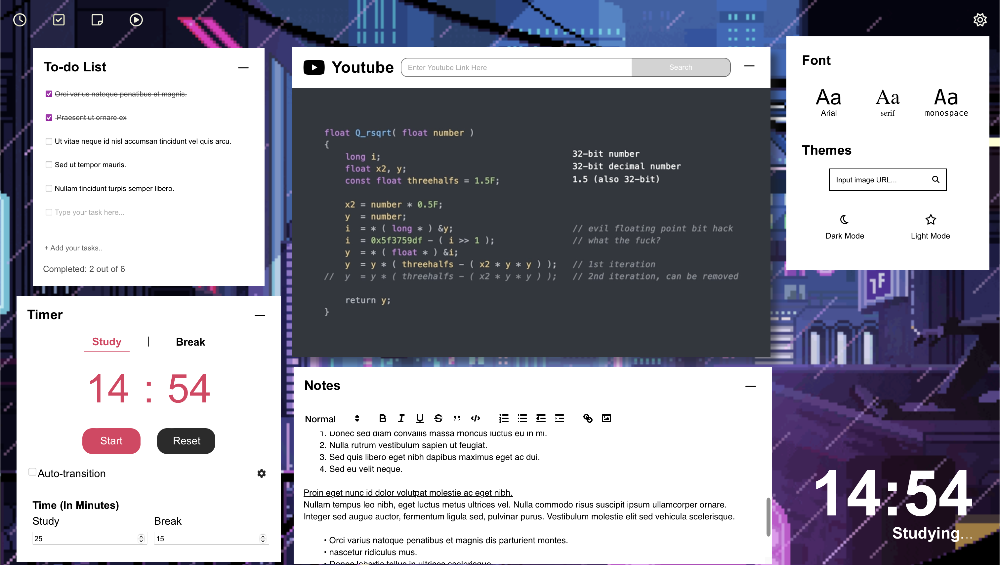
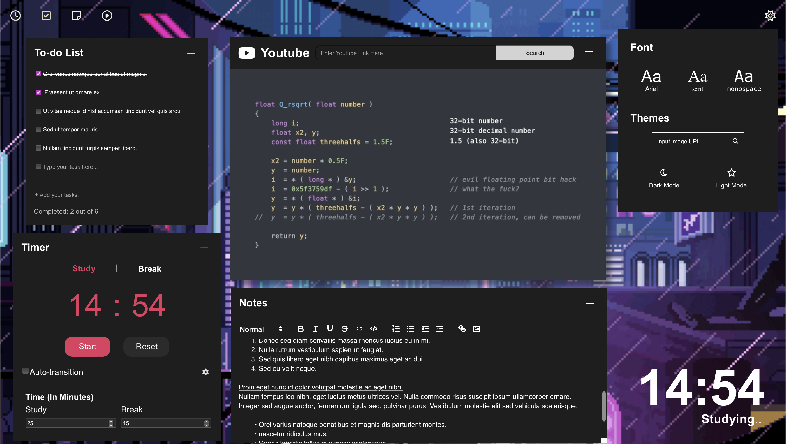
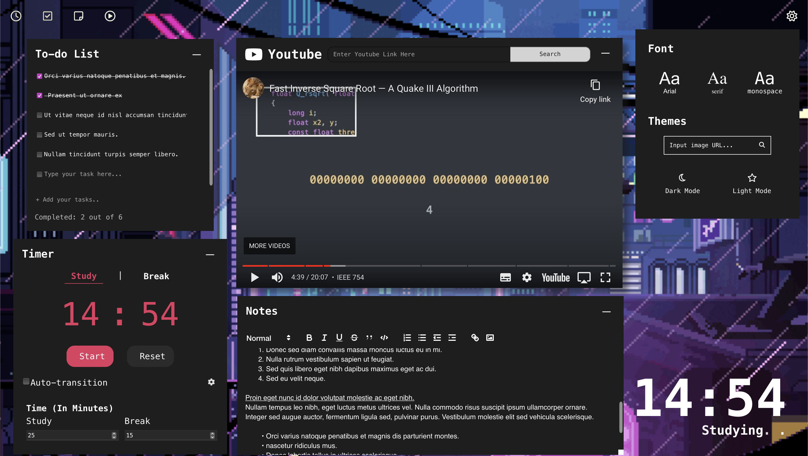

# Loft

## Summary

Loft is a productivity web app with the following widgets,

- Customizable Pomodoro Timer
- Youtube Video Player
- Notepad with Text Formatting
- To Do List

as well as customization settings supporting,

- Themes
  - light mode
  - dark mode
- Fonts
  - Arial
  - Serif
  - Monospace

## How To Start App

```bash
  git clone git@github.com:csesoc/trainee-3-22t3.git
  cd frontend
  npm install
  npm run dev
```

## Tech Stack

- React
- Typescript
- ViteJS
- CSS

# Gallery

## Widgets

### **Timer**


### **To-Do**


### **Notes**


### **Video-Player**


## Themes

### **Light-Mode**



### **Dark-Mode**



## Fonts

### **Monospace**



## Change Background Image


